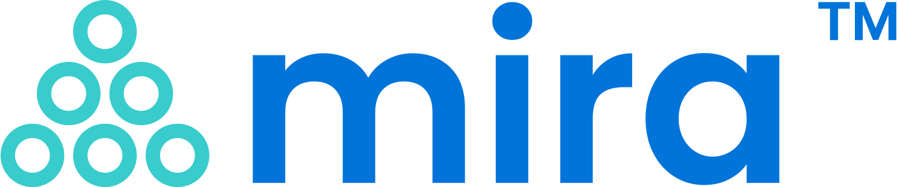

<a href="https://github.com/joba14/mira">
	
</a>

[](./license.md)


# Mira
**The Mira Programming Language and Toolchain**<br>[Report a bug](https://github.com/joba14/mira/issues/new) · [Request a feature](https://github.com/joba14/mira/issues/new)


## Table of Contents
 - [Overview](#overview)
 - [Features](#features)
 - [Getting Started](#getting-started)
 - [Contributing](#contributing)
 - [License](#license)


## Warning
⚠️ **Caution: Experimental and Early Development** ⚠️

This programming language is currently in early stages of development. Use with caution! This language is highly experimental and may not have all the safety features in place.

Expect rapid changes, and be aware that the language is not yet stable for production use. Feedback and contributions are welcome.

[(to the top)](#mira)


## Overview
Welcome to mira, a stack-based, concatenative low-level programming language designed for loosing your mind and shooting yourself in the foot. It compiles to NASM Linux x86_64 assembly, with plans for supporting additional architectures in the future.

This language already supports many (and too often taken for-granted) features commonly found in various programming languages while maintaining a low-level approach, allowing for close interaction with the underlying hardware.

### Features
Here is the list of the main features the language has:
- sections, functions, memories, and strings
- if-else and loops blocks
- comments :)
- arithmetic, bitwise, and logical operations
- comparison operators
- intrinsic functionalities like syscalls and stack manipulation operations
- very minimal std library

[(to the top)](#mira)


## Getting Started
To get started with mira, follow these simple steps:

### Building
The repo provides various syntax and project examples in the [examples](./examples) directory. The project examples use the makefiles and uses various building steps such as pre-processor, assembler and linker to automate the building process. To build and run the example project, follow the steps below:
```sh
> cd <root-of-the-example-project>
> make && make run
```

### Building
Clone the mira repository from GitHub. Navigate to the project directory and run the build script or compiler. This will generate the executable for your specific platform:
```sh
> git clone https://github.com/joba14/mira.git ./mira
> cd mira/mirac/scripts
> ./build.sh debug
```

### Running
To get help and learn more about the compiler, use the following:
```sh
> cd mira/mirac/build
> ./mirac --help
```

Once built successfully, you can run mira programs by providing the source code file as an argument to the compiler (or use makefile template from the example projects):
```sh
> cd mira/mirac/build
> ./mirac -d -u -a nasm_x86_64_linux <path-to-mira-source-file> <path-to-output-asm-file>
> nasm -f elf64 <path-to-output-asm-file> -o <path-to-output-obj-file>
> ld <path-to-output-obj-file> -o <path-to-output-elf-file>
> <path-to-output-elf-file>
```

[(to the top)](#mira)


## Contributing
At this time, I am not actively seeking contributions to the Mira project. I appreciate your interest and enthusiasm for contributing to the project.

The reason for not actively seeking contributions is that I currently do not have well-defined ground rules and guidelines in place for contributors. I want to ensure that the contribution process is clear, fair, and productive for everyone involved.

However, I am always open to feedback, bug reports, and feature requests. If you encounter issues with the project or have ideas for improvements, please feel free to report in this project's repo issues page.

I value your interest in the project, and I may consider establishing contribution guidelines in the future. Until then, thank you for your understanding and support.

[(to the top)](#mira)


## License
The Mira project is released under the **Mira GPLv1** license. Users and contributors are required to review and comply with the license terms specified in the [license.md file](./license.md). The license outlines the permitted usage, distribution, and intellectual property rights associated with the Mira project.

Please refer to the [license.md file](./license.md) for more details. By using, modifying, or distributing the Mira project, you agree to be bound by the terms and conditions of the license.

[(to the top)](#mira)
