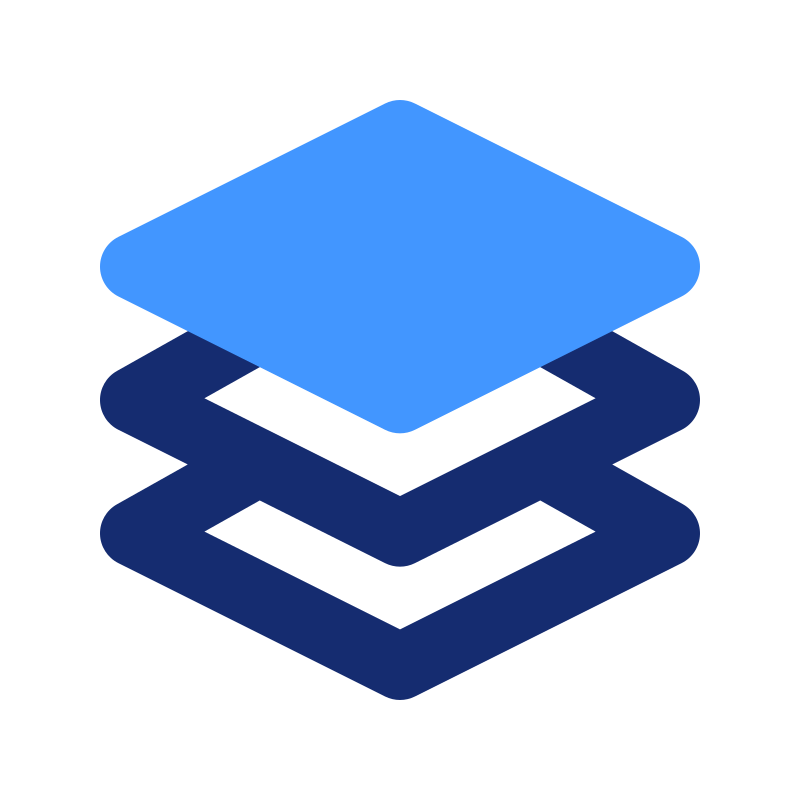

# Mira
**The Mira Programming Language and Toolchain** [Report a bug](https://github.com/joba14/mira/issues/new) · [Request a feature](https://github.com/joba14/mira/issues/new)

## Table of Contents
 - [Overview](#overview)
 - [Features](#features)
 - [Getting Started](#getting-started)
 - [Contributing](#contributing)
 - [License](#license)

## Overview
TODO: !!!

[(to the top)](#mira)

## Features
TODO: !!!

[(to the top)](#mira)

## Getting Started
TODO: !!!

[(to the top)](#mira)

## Contributing
At this time, I am not actively seeking contributions to the Mira Project. I appreciate your interest and enthusiasm for contributing to the project.

The reason for not actively seeking contributions is that I currently do not have well-defined ground rules and guidelines in place for contributors. I want to ensure that the contribution process is clear, fair, and productive for everyone involved.
However, I am always open to feedback, bug reports, and feature requests. If you encounter issues with the project or have ideas for improvements, please feel free to report in this project's repo issues page.

I value your interest in the project, and I may consider establishing contribution guidelines in the future. Until then, thank you for your understanding and support.

[(to the top)](#mira)

## License
The Mira project is released under the **Mira GPLv1** license. Users and contributors are required to review and comply with the license terms specified in the [license.md file](./license.md). The license outlines the permitted usage, distribution, and intellectual property rights associated with the Mira project.

Please refer to the [license.md file](./license.md) for more details. By using, modifying, or distributing the Mira project, you agree to be bound by the terms and conditions of the license.

[(to the top)](#mira)
